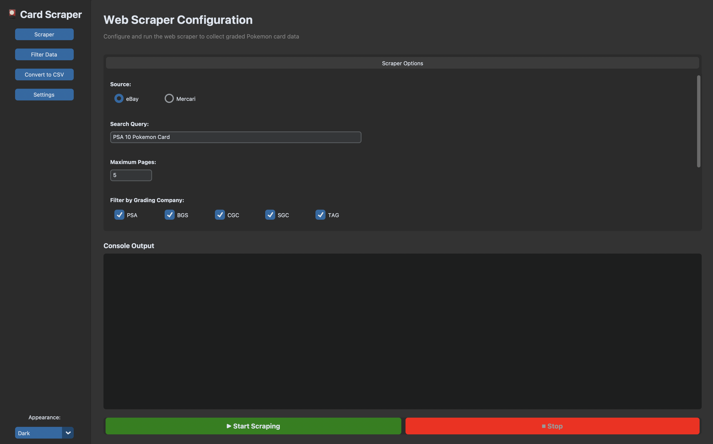
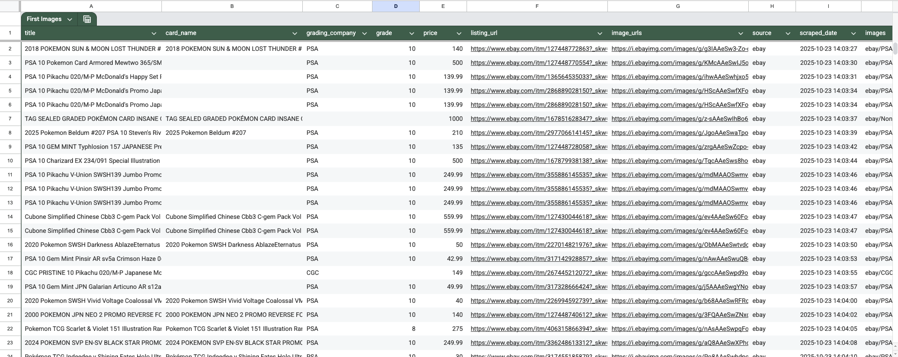

<div align="center">


</div>

# eBay and Mercari Graded Pokemon Card Scraper

A web scraper built with Scrapy and Playwright to collect images and data for graded Pokemon cards from eBay and Mercari. Specifically meant for collecting data used in computer vision models.



## Features

- Scrapes graded TCG card listings from eBay and Mercari based on search query
- **Multiple high-resolution images per listing** (1200-1600px) - front, back, and detail shots
- **Organized by listing** - each listing gets its own folder with all images
- Extracts grading information (PSA, BGS, CGC, SGC, TAG)
- Captures pricing data

<div align="center">

</div>

## Quick Start

### Setup and Launch the Application GUI

```bash
# 1. Install dependencies
pip install -r requirements.txt

# 2. Install Playwright browsers
playwright install chromium

# 3. Install spaCy NLP model (for filtering) titles -> Grading Results
python -m spacy download en_core_web_sm

# 4. Launch GUI
python launch_gui.py
```

## Usage

#### JSON - CSV Data Capture
Items are saved with the following fields:
```json
{
  "title": "2018 POKEMON SUN & MOON LOST THUNDER #121 TYRANITAR GX PSA 10 GEM MINT",
  "card_name": "2018 POKEMON SUN & MOON LOST THUNDER #121 TYRANITAR GX",
  "grading_company": "PSA",
  "grade": "10",
  "price": 140.0,
  "listing_url": "https://www.ebay.com/itm/...",
  "image_urls": ["https://i.ebayimg.com/images/g/.../s-l500.jpg"],
  "images": [{"url": "...", "path": "ebay/PSA/2018_POKEMON_SUN_&_MOON_LOST_THUNDER_#121_TYRANITAR_GX_20251023_140329.jpg"}],
  "source": "ebay",
  "scraped_date": "2025-10-23T14:02:21.754867"
}
```


#### Downloaded Images
Images are automatically organized in:
```
downloaded_images/
  └── ebay/
      ├── PSA/
      ├── BGS/
      ├── CGC/
      └── SGC/
```

Filenames format: `{card_name}_{timestamp}.jpg`

### Filtering Results out

Use the `Filter Data` option within the GUI applicaiton to applying different types of filtering
* filter out meme cards
* Use extra NLP to check for the correct grade
* Look for sealed product or multiple cards being sold in the same listing.

### Known Issues & Limitations

1. **Card Name Parsing**: Some titles don't have clear card names (returns empty string)
   - These items still have full title and other data
   - Can be parsed manually or with improved regex

2. **Price Variations**: Some listings show price ranges (e.g., "$100 to $500")
   - Currently extracts first price found
   - Consider updating regex to handle ranges

3. **Rate Limiting**: eBay may throttle after extended scraping
   - Increase delays if you see challenges
   - Consider using rotating proxies for large-scale scraping


## Tips

1. **Respect Rate Limits**: The scraper includes delays and auto-throttle to avoid overwhelming servers
2. **Custom Searches**: Use specific search queries for better results (e.g., "PSA 10 Base Set Charizard")
3. **Image Storage**: Images are organized by source/grading_company/card_name in the `downloaded_images` folder
4. **Debugging**: Remove `headless: True` in settings.py to see the browser in action

## Troubleshooting

- **No items scraped**: Check if the website structure has changed or increase wait times in Playwright
- **Playwright errors**: Ensure browsers are installed with `playwright install chromium`
- **Rate limiting**: Increase `DOWNLOAD_DELAY` in settings.py

## Legal Notice

Please ensure you comply with eBay's and Mercari's Terms of Service when using this scraper. This tool is for educational purposes only. Be respectful of rate limits and robots.txt files.
