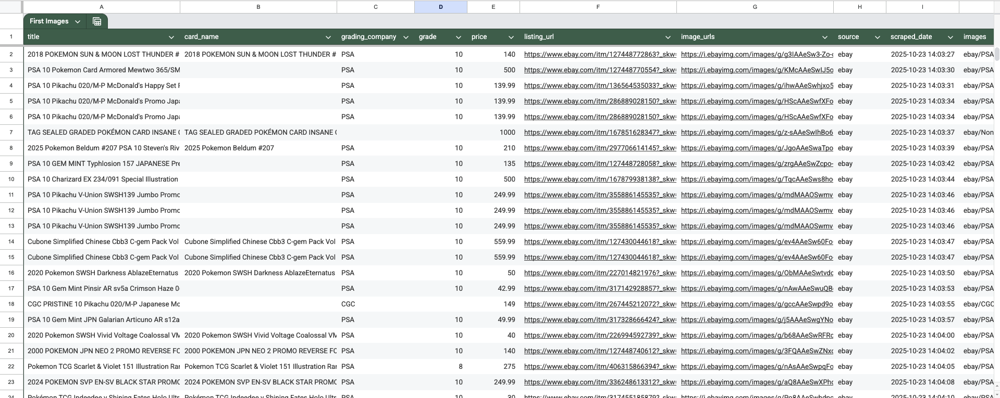

<div align="center">


</div>

# eBay and Mercari Graded Pokemon Card Scraper

A web scraper built with Scrapy and Playwright to collect images and data for graded Pokemon cards from eBay and Mercari.



## ✨ Features

- 🎴 Scrapes graded Pokemon card listings from eBay and Mercari
- 🖼️ **Multiple high-resolution images per listing** (1200-1600px) - front, back, and detail shots
- 📁 **Organized by listing** - each listing gets its own folder with all images
- 📊 Extracts grading information (PSA, BGS, CGC, SGC, TAG)
- 💰 Captures pricing data
- 🔄 Handles pagination automatically
- 🤖 Uses Playwright for JavaScript-heavy pages
- 📈 Automatic CSV conversion with detailed statistics
- 📉 Data analysis and price tracking capabilities
- 🎯 Quality filtering (minimum 400x400px for AI training datasets)
- 📸 Automatic thumbnail-to-high-res URL conversion

<div align="center">

</div>

## 🚀 Quick Start

```bash
# 1. Install dependencies
pip install -r requirements.txt

# 2. Install Playwright browsers
playwright install chromium

# 3. Scrape and get CSV output
scrapy crawl ebay_graded_cards -a search_query="Pokemon PSA 10" -O output.json
python3 convert_to_csv.py output.json --with-stats

# 4. Check results
# - output.json (raw data)
# - output.csv (Excel-ready)
# - output_stats.txt (statistics)
```

## 📖 Usage

## eBay Graded Cards Scraper - Usage Guide

This Scrapy + Playwright scraper successfully extracts graded Pokemon card listings from eBay, including:
- Card titles and parsed card names
- Grading company (PSA, BGS, CGC, SGC, TAG) and grades
- Prices
- Listing URLs
- Card images (automatically downloaded and organized)

### Quick Start

#### 1. Activate Virtual Environment
```bash
cd /Users/nandersen/git_repos/ebay-card-scraper
source venv/bin/activate
```

#### 2. Run the Scraper
```bash
# Basic usage (default: "PSA 10 Pokemon Card", 5 pages)
scrapy crawl ebay_graded_cards -O output.json

# Custom search query
scrapy crawl ebay_graded_cards -a search_query="Pokemon PSA 10 Charizard" -a max_pages=3 -O charizard_output.json

# Search for specific grading companies
scrapy crawl ebay_graded_cards -a search_query="Pokemon BGS 9.5" -a max_pages=2 -O bgs_output.json
```

### Command Line Arguments

| Argument | Default | Description |
|----------|---------|-------------|
| `search_query` | "PSA 10 Pokemon Card" | eBay search query |
| `max_pages` | 5 | Maximum number of pages to scrape (240 items per page) |

### Output Structure

#### JSON Output
Items are saved with the following fields:
```json
{
  "title": "2018 POKEMON SUN & MOON LOST THUNDER #121 TYRANITAR GX PSA 10 GEM MINT",
  "card_name": "2018 POKEMON SUN & MOON LOST THUNDER #121 TYRANITAR GX",
  "grading_company": "PSA",
  "grade": "10",
  "price": 140.0,
  "listing_url": "https://www.ebay.com/itm/...",
  "image_urls": ["https://i.ebayimg.com/images/g/.../s-l500.jpg"],
  "images": [{"url": "...", "path": "ebay/PSA/2018_POKEMON_SUN_&_MOON_LOST_THUNDER_#121_TYRANITAR_GX_20251023_140329.jpg"}],
  "source": "ebay",
  "scraped_date": "2025-10-23T14:02:21.754867"
}
```

#### Downloaded Images
Images are automatically organized in:
```
downloaded_images/
  └── ebay/
      ├── PSA/
      ├── BGS/
      ├── CGC/
      └── SGC/
```

Filenames format: `{card_name}_{timestamp}.jpg`

### Performance

- **Speed**: ~250 items in 10 minutes (~25 items/min)
- **Success Rate**: Successfully bypasses eBay bot detection
- **Image Downloads**: Concurrent downloads with organized storage

### Anti-Bot Detection Features

The scraper includes several measures to avoid detection:
- Custom Chrome 120 user agent
- 1920x1080 viewport
- Disabled automation flags
- Navigator.webdriver property override
- Randomized download delays (2s average)

### Advanced Usage

#### Adjust Download Speed
Edit `graded_cards_scraper/settings.py`:
```python
DOWNLOAD_DELAY = 2  # Seconds between requests
CONCURRENT_REQUESTS = 8  # Total concurrent requests
CONCURRENT_REQUESTS_PER_DOMAIN = 4  # Per domain
```

#### Change Image Storage Location
Edit `graded_cards_scraper/settings.py`:
```python
IMAGES_STORE = '/custom/path/to/images'
```

#### Adjust Image Quality for AI Training
Edit `graded_cards_scraper/settings.py`:
```python
# Increase minimum dimensions for higher quality dataset
IMAGES_MIN_HEIGHT = 800  # Default: 400
IMAGES_MIN_WIDTH = 800   # Default: 400

# Adjust download timeout for large high-res images
DOWNLOAD_TIMEOUT = 60  # Default: 30
```

See [HIGH_RESOLUTION_IMAGES.md](HIGH_RESOLUTION_IMAGES.md) for detailed information about image quality optimization for AI training.

#### Enable/Disable Headless Mode
Edit `graded_cards_scraper/settings.py`:
```python
PLAYWRIGHT_LAUNCH_OPTIONS = {
    "headless": False,  # Set to False to see browser
    "args": [
        "--disable-blink-features=AutomationControlled",
    ],
}
```

### Troubleshooting

#### Images Not Downloading
- Check `downloaded_images/` folder exists
- Verify `allowed_domains` includes `ebayimg.com` in spider
- Check pipeline is enabled in settings

#### Bot Detection / Challenge Pages
- Increase `DOWNLOAD_DELAY` in settings
- Check user agent is up to date
- Verify anti-automation flags are set

#### No Items Scraped
- Check eBay page structure hasn't changed
- Verify selectors in `ebay_spider.py`:
  - Items: `ul.srp-results li`
  - Title: `img::attr(alt)`
  - Price: `*::text` with regex `r'\$[\d,]+\.?\d*'`
  - URL: `a.image-treatment::attr(href)`

### Example Queries

```bash
# PSA 10 Pikachu cards
scrapy crawl ebay_graded_cards -a search_query="Pikachu PSA 10" -O pikachu.json

# Vintage cards
scrapy crawl ebay_graded_cards -a search_query="Pokemon Base Set PSA 10" -O vintage.json

# High-value cards
scrapy crawl ebay_graded_cards -a search_query="Pokemon PSA 10 1st Edition" -O first_edition.json

# BGS graded cards
scrapy crawl ebay_graded_cards -a search_query="Pokemon BGS 10" -O bgs_10.json
```

### Data Analysis

#### Image Quality Analysis (For AI Training)

After scraping, analyze image quality:
```bash
# Analyze all downloaded images
python analyze_image_quality.py

# Analyze specific directory
python analyze_image_quality.py downloaded_images/ebay/PSA
```

This will show:
- Total images and quality distribution
- Average dimensions by source and grading company
- AI training readiness assessment
- Recommendations for filter adjustments

#### JSON Data Analysis

View scraped data:
```bash
# Pretty print first 5 items
python3 -c "import json; data=json.load(open('output.json')); print(json.dumps(data[:5], indent=2))"

# Count items by grading company
python3 -c "import json; from collections import Counter; data=json.load(open('output.json')); print(Counter(item['grading_company'] for item in data))"

# Average price by grade
python3 -c "import json; from statistics import mean; data=json.load(open('output.json')); grades={}; [grades.setdefault(item['grade'], []).append(item['price']) for item in data if item.get('price')]; print({g:mean(prices) for g, prices in grades.items()})"
```

### Known Issues & Limitations

1. **Card Name Parsing**: Some titles don't have clear card names (returns empty string)
   - These items still have full title and other data
   - Can be parsed manually or with improved regex

2. **Price Variations**: Some listings show price ranges (e.g., "$100 to $500")
   - Currently extracts first price found
   - Consider updating regex to handle ranges

3. **Rate Limiting**: eBay may throttle after extended scraping
   - Increase delays if you see challenges
   - Consider using rotating proxies for large-scale scraping


### CSV Conversion

Convert JSON output to Excel/CSV format with statistics:

```bash
# Automatic conversion (recommended)
scrapy crawl ebay_graded_cards -O pokemon.json
python3 convert_to_csv.py pokemon.json --with-stats

# Manual conversion
python3 convert_to_csv.py output.json

# Batch convert multiple files
python3 convert_to_csv.py --batch scraped_data/

# Merge multiple CSV files
python3 convert_to_csv.py --merge file1.csv file2.csv -o combined.csv
```

### Example Statistics Output

```
Total Items Scraped: 255
Average Price: $378.26
Median Price: $250.00
Total Value: $96,456.69

Items by Grading Company:
  PSA: 248
  CGC: 4

Top Card: $4,799.00 - 2016 Pokemon Charizard EX (PSA 10)
```

## 📁 Project Structure

```
ebay-card-scraper/
├── utils/                          # Utility modules (NEW!)
│   ├── __init__.py                 # Package initialization with exports
│   ├── analyze_image_quality.py   # Image quality analysis functions
│   └── convert_to_csv.py           # CSV conversion functions
├── graded_cards_scraper/           # Main scraper package
│   ├── spiders/                    # Spider implementations
│   ├── utils.py                    # Re-exports from utils package (backward compatibility)
│   ├── items.py                    # Data models
│   ├── pipelines.py                # Data processing pipelines
│   ├── extensions.py               # Custom Scrapy extensions
│   └── settings.py                 # Scraper configuration
├── analyze_image_quality.py        # CLI wrapper for image analysis
├── convert_to_csv.py               # CLI wrapper for CSV conversion
├── downloaded_images/              # Downloaded card images
├── scraped_data/                   # JSON/CSV output files
└── requirements.txt                # Python dependencies
```

### Using the Utils Package

The utility functions are now organized in a dedicated `utils/` package for better code organization:

```python
# Import from the utils package directly
from utils.analyze_image_quality import analyze_image_quality, print_statistics
from utils.convert_to_csv import json_to_csv, batch_json_to_csv

# Or use the CLI wrappers
# python analyze_image_quality.py downloaded_images/
# python convert_to_csv.py output.json --with-stats
```

For backward compatibility, the functions are also available through `graded_cards_scraper.utils`:
```python
from graded_cards_scraper.utils import json_to_csv  # Still works!
```

## Configuration

Edit `graded_cards_scraper/settings.py` to customize:

- `DOWNLOAD_DELAY`: Delay between requests (default: 2 seconds)
- `CONCURRENT_REQUESTS`: Number of concurrent requests (default: 8)
- `IMAGES_STORE`: Directory for downloaded images
- `PLAYWRIGHT_LAUNCH_OPTIONS`: Browser settings (headless mode, etc.)

## Data Fields

Each scraped item includes:

- `card_name`: Name of the Pokemon card
- `card_number`: Card number (if available)
- `set_name`: Pokemon set name (if available)
- `grading_company`: Grading company (PSA, BGS, CGC, etc.)
- `grade`: Card grade (e.g., 10, 9.5)
- `title`: Full listing title
- `price`: Listing price
- `currency`: Currency (USD)
- `source`: 'ebay' or 'mercari'
- `listing_url`: URL to the listing
- `image_urls`: List of image URLs
- `images`: List of downloaded image paths
- `scraped_date`: Timestamp of when the data was scraped

## Tips

1. **Respect Rate Limits**: The scraper includes delays and auto-throttle to avoid overwhelming servers
2. **Custom Searches**: Use specific search queries for better results (e.g., "PSA 10 Base Set Charizard")
3. **Image Storage**: Images are organized by source/grading_company/card_name in the `downloaded_images` folder
4. **Debugging**: Remove `headless: True` in settings.py to see the browser in action

## Troubleshooting

- **No items scraped**: Check if the website structure has changed or increase wait times in Playwright
- **Playwright errors**: Ensure browsers are installed with `playwright install chromium`
- **Rate limiting**: Increase `DOWNLOAD_DELAY` in settings.py

## Legal Notice

Please ensure you comply with eBay's and Mercari's Terms of Service when using this scraper. This tool is for educational purposes only. Be respectful of rate limits and robots.txt files.

## License

MIT License
